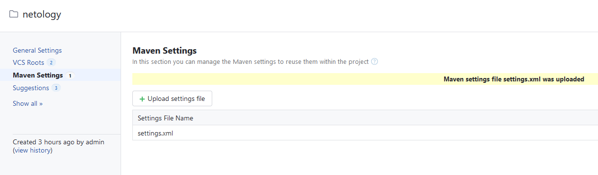

## Подготовка к выполнению

1. В Yandex Cloud создайте новый инстанс (4CPU4RAM) на основе образа jetbrains/teamcity-server.


2. Дождитесь запуска teamcity, выполните первоначальную настройку.


3. Создайте ещё один инстанс (2CPU4RAM) на основе образа jetbrains/teamcity-agent. Пропишите к нему переменную окружения SERVER_URL: "http://<teamcity_url>:8111".


4. Авторизуйте агент.


5. Сделайте fork [репозитория](https://github.com/aragastmatb/example-teamcity).

6. Создайте VM (2CPU4RAM) и запустите [playbook](./infrastructure/site.yml).


## Основная часть

1. Создайте новый проект в teamcity на основе fork.


2. Сделайте autodetect конфигурации.


3. Сохраните необходимые шаги, запустите первую сборку master.


4. Поменяйте условия сборки: если сборка по ветке master, то должен происходит mvn clean deploy, иначе mvn clean test.


5. Для deploy будет необходимо загрузить [settings.xml](https://github.com/netology-code/mnt-homeworks/blob/MNT-video/09-ci-05-teamcity/teamcity/settings.xml) в набор конфигураций maven у teamcity, предварительно записав туда креды для подключения к nexus.




6. В pom.xml необходимо поменять ссылки на репозиторий и nexus.

>Ответ: [pom.xml](/pom.xml)

7. Запустите сборку по master, убедитесь, что всё прошло успешно и артефакт появился в nexus.


8. Мигрируйте build configuration в репозиторий.


9. Создайте отдельную ветку feature/add_reply в репозитории.


`git checkout feature/add_reply`

10. Напишите новый метод для класса Welcomer: метод должен возвращать произвольную реплику, содержащую слово hunter.

```
public String sayHunter(){
		return "Find hunter always";
	}
```

11. Дополните тест для нового метода на поиск слова hunter в новой реплике.

```
@Test
	public void welcomerSaysHunter() {
		assertThat(welcomer.sayHunter(), containsString("hunter"));
	}
```

12. Сделайте push всех изменений в новую ветку репозитория.
13. Убедитесь, что сборка самостоятельно запустилась, тесты прошли успешно.
